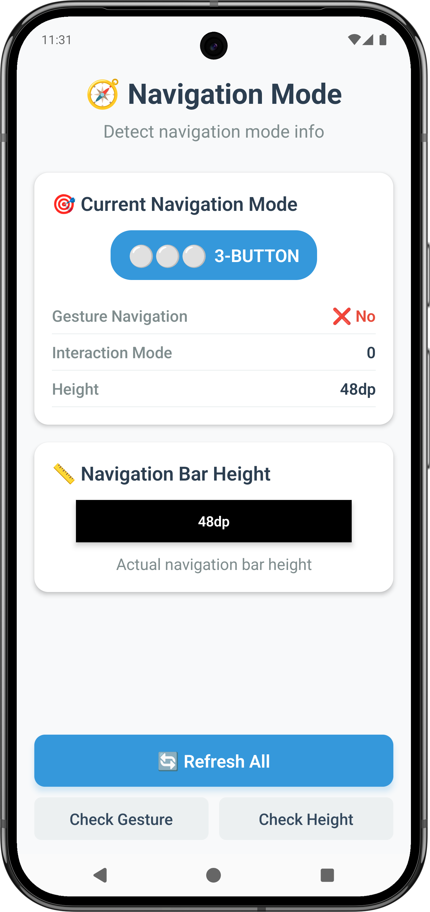
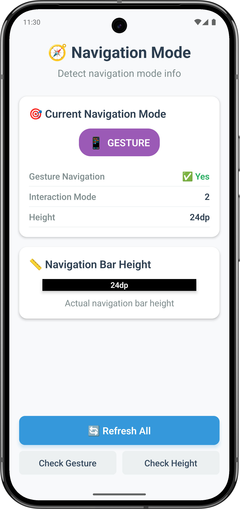

# react-native-navigation-mode

🧭 Detect Android navigation mode (3-button, 2-button, or gesture navigation) with native precision using Turbo modules.

[](https://badge.fury.io/js/react-native-navigation-mode) [](https://github.com/JairajJangle/react-native-navigation-mode/blob/main/LICENSE) [](https://github.com/JairajJangle/react-native-navigation-mode/actions/workflows/ci.yml)   [](https://github.com/JairajJangle/react-native-navigation-mode/issues?q=is%3Aopen+is%3Aissue)    

<table align="center">
  <tr>
    <td align="center"></td>
    <td align="center"></td>
  </tr>
</table>


<div align="center">
  <table>
    <tr>
      <td align="center">
        
        <br />
        <small>Traditional Android navigation</small>
      </td>
      <td align="center">
        
        <br />
        <small>Home + Back buttons</small>
      </td>
      <td align="center">
        
        <br />
        <small>Swipe-based navigation</small>
      </td>
    </tr>
  </table>
</div>

## ✨ Features

- 🎯 **Direct Native Detection** - No hacky workarounds or dimension-based guessing
- ⚡ **Turbo Module** - Built with the latest React Native architecture
- 🔄 **Real-time Detection** - Accurate navigation mode identification
- 📱 **Cross Platform** - Android detection + iOS compatibility
- 🎣 **React Hooks** - Easy integration with `useNavigationMode()`
- 🚀 **Expo Compatible** - Works with Expo managed workflow (dev builds)
- 📦 **Zero Dependencies** - Lightweight and performant
- 🛡️ **TypeScript** - Full type safety out of the box

## Installation

Using yarn:

```sh
yarn add react-native-navigation-mode
```

Using npm:

```sh
npm install react-native-navigation-mode
```

### For Expo Managed Workflow

```sh
npx expo install react-native-navigation-mode
```

Add the plugin to your `app.config.js`:

```javascript
export default {
  expo: {
    plugins: ["react-native-navigation-mode"],
  },
};
```

Create a development build:

```sh
npx expo run:android
```

> ⚠️ **Note:** This library requires a development build and will NOT work in Expo Go due to native code requirements.

### For React Native CLI

Auto-linking handles setup automatically for React Native 0.60+.

## Usage

### Quick Check

```typescript
import { isGestureNavigation } from 'react-native-navigation-mode';

// Simple boolean check
const isGesture = await isGestureNavigation();
console.log('Gesture navigation:', isGesture); // true/false
```

### Detailed Information

```typescript
import { getNavigationMode } from 'react-native-navigation-mode';

// Get comprehensive navigation info
const navInfo = await getNavigationMode();
console.log('Navigation type:', navInfo.type); // '3_button', '2_button', 'gesture', or 'unknown'
console.log('SDK version:', navInfo.sdkVersion);
console.log('Device model:', navInfo.deviceModel);
```

### React Hook (Recommended)

```typescript
import React from 'react';
import { View, Text } from 'react-native';
import { useNavigationMode } from 'react-native-navigation-mode';

export default function NavigationInfo() {
  const { navigationMode, loading, error } = useNavigationMode();

  if (loading) return <Text>Detecting navigation mode...</Text>;
  if (error) return <Text>Error: {error.message}</Text>;

  return (
    <View>
      <Text>Navigation Type: {navigationMode?.type}</Text>
      <Text>Gesture Navigation: {navigationMode?.isGestureNavigation ? 'Yes' : 'No'}</Text>
      <Text>Has Navigation Bar: {navigationMode?.hasNavigationBar ? 'Yes' : 'No'}</Text>
      <Text>Android SDK: {navigationMode?.sdkVersion}</Text>
      <Text>Device: {navigationMode?.deviceModel}</Text>
    </View>
  );
}
```

### Conditional UI Rendering

```typescript
import React from 'react';
import { View } from 'react-native';
import { useNavigationMode } from 'react-native-navigation-mode';

export default function AdaptiveUI() {
  const { navigationMode } = useNavigationMode();

  return (
    <View 
      style={{
        paddingBottom: navigationMode?.isGestureNavigation ? 34 : 48 // Adjust for gesture nav
      }}
    >
      {/* Your content */}
    </View>
  );
}
```

## API Reference

### Functions

#### `getNavigationMode(): Promise<NavigationModeInfo>`

Returns comprehensive navigation mode information.

#### `isGestureNavigation(): Promise<boolean>`

Quick check if device is using gesture navigation.

### Hooks

#### `useNavigationMode(): { navigationMode, loading, error }`

React hook for navigation mode detection with loading and error states.

### Types

#### `NavigationModeInfo`

| Property            | Type                                           | Description                                      |
| ------------------- | ---------------------------------------------- | ------------------------------------------------ |
| type                | `'3_button' \| '2_button' \| 'gesture' \| 'unknown'` | Navigation mode type                             |
| isGestureNavigation | `boolean`                                      | Whether gesture navigation is active             |
| hasNavigationBar    | `boolean`                                      | Whether device has a navigation bar              |
| sdkVersion          | `number`                                       | Android SDK version (iOS: iOS version)          |
| deviceModel         | `string`                                       | Device model name                                |
| interactionMode     | `number \| undefined`                          | Raw Android interaction mode (0, 1, 2, or -1)   |

## Platform Support

| Platform | Support | Notes |
|----------|---------|-------|
| Android  | ✅ Full | Detects all navigation modes via native Android APIs |
| iOS      | ✅ Compatible | Always returns `gesture` (iOS uses gesture navigation) |

### Android Compatibility

- **API 21+** - Basic navigation bar detection
- **API 29+** - Full navigation mode detection (`config_navBarInteractionMode`)
- **All versions** - Fallback detection methods included

## How It Works

The library uses multiple detection methods for maximum accuracy:

1. **`config_navBarInteractionMode`** - Official Android configuration (API 29+)
2. **Settings Provider** - Checks `navigation_mode` system setting
3. **Navigation Bar Detection** - Validates navigation bar presence
4. **Hardware Key Detection** - Fallback for older devices

### Navigation Mode Values

| Android Mode | Type | Description |
|--------------|------|-------------|
| 0 | `3_button` | Traditional Android navigation (Back, Home, Recent) |
| 1 | `2_button` | Two-button navigation (Back, Home) |
| 2 | `gesture` | Full gesture navigation |
| -1 | `unknown` | Could not determine navigation mode |

## Notes

1. 🍎 **iOS Behavior** - iOS always returns `isGestureNavigation: true` since iOS doesn't have 3-button navigation
2. 📱 **Expo Go** - Not supported due to native module requirements. Use development builds instead
3. ⚡ **Performance** - Turbo module ensures minimal performance impact
4. 🔄 **Real-time** - Navigation mode is detected at call time, reflecting current device settings

## Troubleshooting

### Common Issues

**"TurboModuleRegistry.getEnforcing(...) is not a function"**
- Ensure you're using React Native 0.68+ with new architecture enabled
- For older RN versions, the module will fallback gracefully

**Expo Go not working**
- This is expected. Create a development build with `npx expo run:android`

**Always returns 'unknown' on Android**
- Check if your device/emulator supports the navigation mode APIs
- Some custom ROMs may not expose standard Android navigation settings

## Contributing

See the [contributing guide](CONTRIBUTING.md) to learn how to contribute to the repository and the development workflow.

## License

MIT

## Support the project

<p align="center" valign="center">
  <a href="https://liberapay.com/FutureJJ/donate">
     
  </a>
  &nbsp;&nbsp;&nbsp;&nbsp;&nbsp;&nbsp;&nbsp;&nbsp;&nbsp;
  <a href=".github/assets/Jairaj_Jangle_Google_Pay_UPI_QR_Code.jpg">
    
  </a>
  &nbsp;&nbsp;&nbsp;&nbsp;&nbsp;&nbsp;&nbsp;&nbsp;&nbsp;
  <a href="https://www.paypal.com/paypalme/jairajjangle001/usd">
    
  </a>
</p>

## ❤️ Thanks to

- Module built using [create-react-native-library](https://github.com/callstack/react-native-builder-bob)
- Inspiration from various Android navigation detection attempts in the community
- React Native team for Turbo Modules architecture
- Expo team for config plugin support
- Readme is edited using [Typora](https://typora.io/)

---
